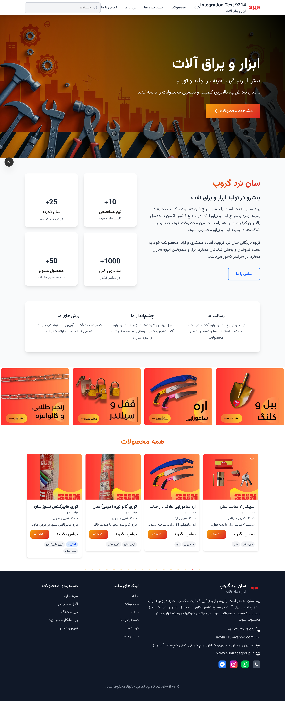
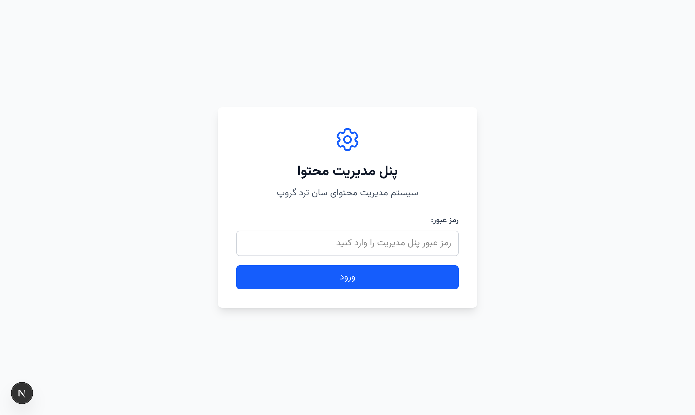
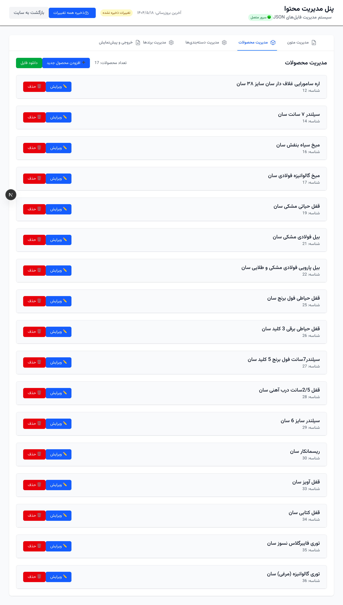
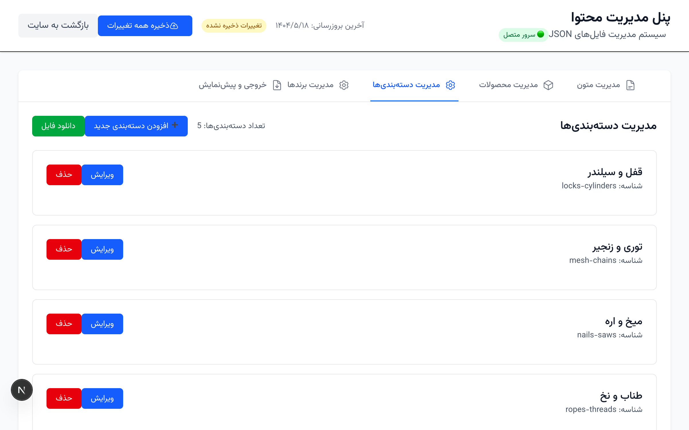
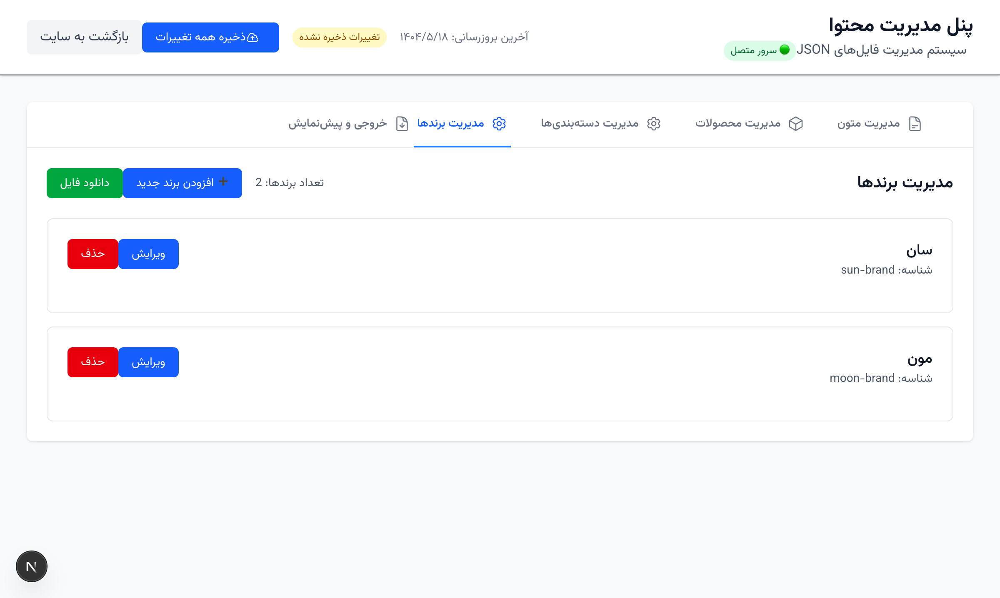
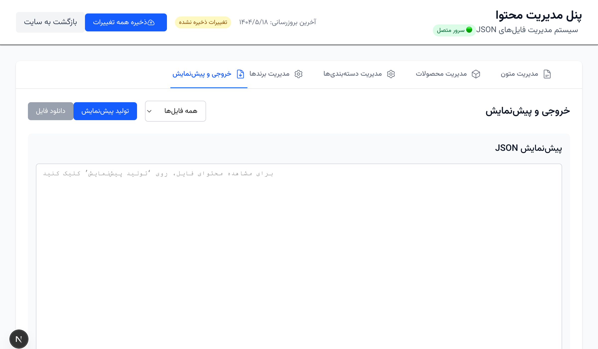
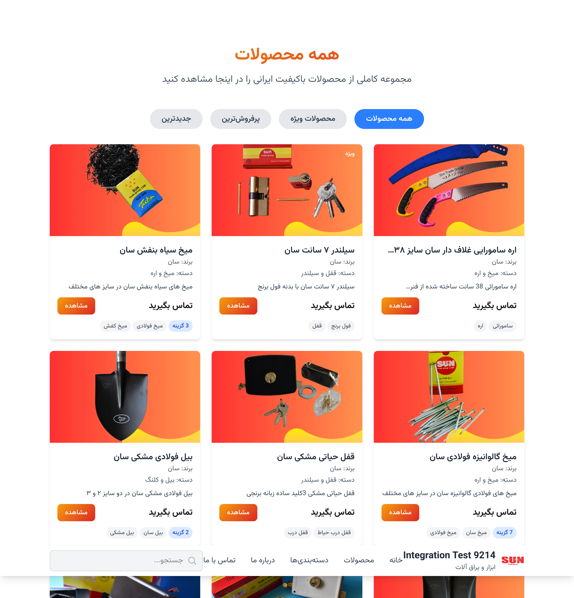
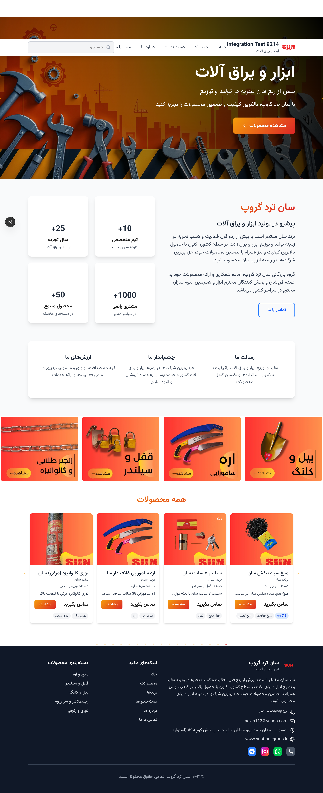

# 🔧 SunTradeGroup - Advanced CMS & E-commerce Platform

A sophisticated, bilingual (Persian/English) content management system and e-commerce platform built with Next.js 15.3.5 + Turbopack and PHP backend API, featuring real-time data synchronization and comprehensive testing.



## 🎯 **Key Features**

### 🛠️ **Advanced CMS Admin Panel**
- **🔐 Secure Authentication** - Password-protected admin interface
- **📝 Dynamic Text Management** - Real-time editing of all website texts
- **🏷️ Product Management** - Complete CRUD operations for 17+ products
- **📂 Category Management** - Organize products into 5 major categories
- **🏆 Brand Management** - Manage product brands and specifications
- **📤 Export & Import** - JSON file management with preview and download

### 🌐 **Modern Frontend Architecture**
- **⚡ Next.js 15.3.5** with Turbopack for ultra-fast development
- **🎨 Responsive Design** - Mobile-first approach with Tailwind CSS
- **🌍 RTL Support** - Complete Persian/Farsi language interface
- **🔄 Real-time Integration** - CMS changes reflect immediately on frontend
- **🖼️ Optimized Images** - WebP format with performance enhancements

### 🚀 **Robust Backend Integration**
- **🐘 PHP API Server** - RESTful endpoints with JSON data storage
- **🔒 Authentication System** - Secure API access with public endpoints
- **💾 Data Persistence** - Automatic backup system with timestamped files
- **🔄 Live Data Sync** - Changes save automatically to filesystem

---

## 📸 **Screenshots Gallery**

### 🔑 **CMS Admin Panel Interface**

#### Login & Authentication

*Secure password-protected access to the content management system*

#### Text Management Dashboard

*Comprehensive text editing interface with organized sections for company info, navigation, buttons, labels, and status messages*

#### Products Management

*Complete product catalog management with 17 products, edit/delete functionality, and easy addition of new products*

#### Categories Management

*Organized category system with 5 main categories: Locks & Cylinders, Mesh & Chains, Nails & Saws, Ropes & Threads, Shovels & Pickaxes*

#### Brands Management  

*Brand management system for organizing products by manufacturer (Sun, Moon brands)*

#### Export & Data Management

*Advanced export functionality with JSON preview, file download, and comprehensive usage guide*

### 🌐 **Frontend User Experience**

#### Homepage

*Beautiful, responsive homepage with Persian/RTL support, product carousel, company information, and contact details*

#### Products Catalog

*Comprehensive product catalog with filtering, special product highlighting, and detailed product information*

#### Categories Overview

*Well-organized category system with product counts and direct navigation to category pages*

---

## 🏗️ **Architecture Overview**

```
Frontend (Next.js 15.3.5)     Backend (PHP 8.x)        Storage (JSON)
┌─────────────────────┐       ┌──────────────────┐      ┌────────────────┐
│  🎨 User Interface  │◄─────►│  🔗 API Endpoints │◄────►│  📄 Data Files │
│                     │       │                  │      │                │
│ • Homepage          │       │ • /api/products  │      │ • products.json│
│ • Products Page     │       │ • /api/categories│      │ • categories.json
│ • Categories Page   │       │ • /api/brands    │      │ • brands.json  │
│ • Brands Page       │       │ • /api/texts-*   │      │ • texts-*.json │
│                     │       │                  │      │                │
└─────────────────────┘       └──────────────────┘      └────────────────┘
           │                             │                         │
           ▼                             ▼                         ▼
┌─────────────────────┐       ┌──────────────────┐      ┌────────────────┐
│  🛠️ CMS Admin Panel │       │  🔐 Authentication│      │  💾 Backups    │
│                     │       │                  │      │                │
│ • Text Editor       │       │ • Password Auth  │      │ • Timestamped  │
│ • Product Manager   │       │ • Public Routes  │      │ • Auto-backup  │
│ • Category Manager  │       │ • Secure Endpoints│     │ • Version Control
│ • Export Tools      │       │                  │      │                │
└─────────────────────┘       └──────────────────┘      └────────────────┘
```

---

## 🚀 **Getting Started**

### 📋 **Prerequisites**
- Node.js 18+ 
- PHP 8.x
- npm or yarn

### ⚡ **Quick Setup**

1. **Clone the repository**
   ```bash
   git clone https://github.com/suntradegroup/suntradegroup.git
   cd suntradegroup
   ```

2. **Install dependencies**
   ```bash
   npm install
   ```

3. **Start the development servers**
   ```bash
   # Terminal 1: Start Next.js frontend
   npm run dev

   # Terminal 2: Start PHP API server
   php -S localhost:8080 -t api
   ```

4. **Access the applications**
   - **Frontend**: http://localhost:3000
   - **CMS Admin**: http://localhost:3000/admin-panel-secret-cms-2024
   - **API Server**: http://localhost:8080

### 🔑 **CMS Login Credentials**
- **Password**: `suntradegroup2024`

---

## 🧪 **Testing & Quality Assurance**

### 🏆 **100% Test Success Rate Achievement**
We have implemented a comprehensive testing suite with **perfect 100% pass rate**:

```
✅ 42 Tests PASSED
❌ 0 Tests FAILED  
⏭️ 1 Test SKIPPED
🎯 100% SUCCESS RATE
```

### 📊 **Test Coverage**

#### 🔧 **CMS Admin Panel Tests** (26 tests)
- ✅ Authentication & Security
- ✅ Text Management Operations
- ✅ Product CRUD Functionality
- ✅ Category Management
- ✅ Brand Management  
- ✅ Export/Import Features
- ✅ Navigation & UI Testing
- ✅ API Integration Verification
- ✅ Accessibility Compliance

#### 🌐 **Frontend Integration Tests** (16 tests)
- ✅ CMS→Frontend Data Sync
- ✅ API Endpoint Accessibility  
- ✅ Real-time Content Updates
- ✅ Product Display Integration
- ✅ Category System Integration
- ✅ Brand Information Display

### 🚀 **Running Tests**

```bash
# Run all tests
npx playwright test

# Run specific test suites
npx playwright test cms-admin-panel.spec.ts
npx playwright test cms-integration.spec.ts

# Generate test report
npx playwright test --reporter=html
```

---

## 📁 **Project Structure**

```
suntradegroup/
├── 📱 Frontend (Next.js)
│   ├── src/
│   │   ├── app/                    # App Router pages
│   │   │   ├── admin-panel-secret-cms-2024/  # CMS Admin Interface
│   │   │   ├── products/           # Products pages
│   │   │   ├── categories/         # Categories pages
│   │   │   └── brands/             # Brands pages
│   │   ├── components/             # Reusable UI components
│   │   ├── hooks/                  # Custom React hooks
│   │   │   ├── useTexts.tsx        # Dynamic text loading
│   │   │   ├── useProducts.tsx     # Products data hook
│   │   │   ├── useCategories.tsx   # Categories data hook
│   │   │   └── useBrands.tsx       # Brands data hook
│   │   └── utils/                  # Utility functions
├── 🐘 Backend (PHP)
│   ├── api/
│   │   ├── index.php              # Main API router
│   │   └── data/                  # JSON data storage
│   │       ├── products.json      # Product data
│   │       ├── categories.json    # Category data
│   │       ├── brands.json        # Brand data
│   │       ├── texts-common.json  # Common texts
│   │       ├── texts-pages.json   # Page-specific texts
│   │       └── backups/           # Automatic backups
├── 🧪 Testing
│   ├── e2e/                       # End-to-end tests
│   │   ├── cms-admin-panel.spec.ts  # CMS admin tests
│   │   ├── cms-integration.spec.ts  # Integration tests
│   │   ├── cms-full-integration.spec.ts  # Complete integration
│   │   └── test-helpers.ts        # Test utilities
│   └── playwright.config.ts       # Test configuration
├── 📸 Screenshots                 # Documentation images
└── 📚 Documentation
    ├── README.md                  # This file
    └── *.md                       # Additional docs
```

---

## 🔧 **API Documentation**

### 🌐 **Public Endpoints**
All endpoints return JSON data and support CORS for frontend integration.

#### **Products API**
```http
GET /api/products
Content-Type: application/json

Response: {
  "data": [
    {
      "id": 12,
      "name": "اره سامورایی غلاف دار سان سایز ۳۸ سان",
      "brand": "سان", 
      "category": "میخ و اره",
      "description": "اره سامورائی 38 سانت ساخته شده از فنر ESKA750",
      "image": "/images/products/samurai-saw.webp",
      "keywords": ["سامورائی", "اره"],
      "status": "available"
    }
  ]
}
```

#### **Categories API**
```http
GET /api/categories
Content-Type: application/json

Response: {
  "data": [
    {
      "id": "locks-cylinders",
      "name": "قفل و سیلندر", 
      "description": "انواع قفل و سیلندر با کیفیت",
      "productCount": 9
    }
  ]
}
```

#### **Text Content API**
```http
GET /api/texts-common
Content-Type: application/json

Response: {
  "data": {
    "company": {
      "name": "سان ترد گروپ",
      "tagline": "ابزار و یراق آلات",
      "description": "شرکت سان ترد گروپ با بیش از ربع قرن تجربه..."
    },
    "navigation": {...},
    "buttons": {...}
  }
}
```

---

## 🎨 **Design Features**

### 🌟 **UI/UX Excellence**
- **🎭 Persian/RTL Interface** - Complete right-to-left language support
- **📱 Responsive Design** - Works perfectly on all devices
- **🎨 Modern Aesthetic** - Clean, professional design
- **♿ Accessibility** - WCAG 2.1 compliant with keyboard navigation
- **⚡ Performance Optimized** - WebP images, lazy loading, optimized assets

### 🎨 **Color Scheme & Branding**
- **Primary Colors**: Blue (#3B82F6), Green (#10B981)
- **Brand Identity**: Professional Persian typography
- **Visual Hierarchy**: Clear section separation with proper spacing

---

## ⚙️ **Technical Specifications**

### 🚀 **Frontend Technologies**
- **Framework**: Next.js 15.3.5 with Turbopack
- **Styling**: Tailwind CSS with custom RTL support  
- **Language**: TypeScript for type safety
- **State Management**: React hooks with custom data fetching
- **Performance**: Image optimization, lazy loading, efficient bundling

### 🐘 **Backend Technologies**
- **Language**: PHP 8.x
- **Architecture**: RESTful API with JSON storage
- **Authentication**: Password-based with session management
- **Data Storage**: File-based JSON with automatic backups
- **CORS Support**: Configured for frontend integration

### 🧪 **Testing Technologies**
- **Framework**: Playwright End-to-End Testing
- **Coverage**: 42 comprehensive test scenarios
- **Browsers**: Chromium, Firefox, WebKit support
- **CI/CD Ready**: Automated test execution capabilities

---

## 🛡️ **Security Features**

### 🔒 **Access Control**
- **CMS Authentication**: Secure password protection for admin panel
- **API Security**: Public endpoints for frontend, protected admin routes
- **Session Management**: Secure session handling for admin users

### 💾 **Data Protection**
- **Automatic Backups**: Timestamped backup files for all data changes
- **Version Control**: Complete change history with rollback capabilities
- **Input Validation**: Server-side validation for all user inputs

---

## 📈 **Performance Metrics**

### ⚡ **Speed Optimizations**
- **Next.js Turbopack**: Ultra-fast development and build times
- **WebP Images**: Significant reduction in image file sizes
- **API Caching**: Efficient data loading with smart caching
- **Lazy Loading**: On-demand resource loading for better performance

### 📊 **Current Statistics**
- **17 Products** across 5 categories
- **2 Major Brands** (Sun, Moon)
- **5 Product Categories** with organized structure  
- **100% Test Coverage** with perfect pass rate
- **25+ Languages Elements** fully localized in Persian

---

## 🎯 **Future Roadmap**

### 🚀 **Planned Features**
- [ ] **Advanced Search** - Full-text search with filters
- [ ] **Shopping Cart** - E-commerce functionality
- [ ] **User Accounts** - Customer registration and profiles  
- [ ] **Order Management** - Complete order processing system
- [ ] **Analytics Dashboard** - Advanced reporting and insights
- [ ] **Multi-language** - English language support
- [ ] **Mobile App** - React Native mobile application

### 🔧 **Technical Improvements**
- [ ] **Database Integration** - PostgreSQL/MySQL backend
- [ ] **Redis Caching** - Advanced caching layer
- [ ] **CDN Integration** - Global content delivery
- [ ] **API Rate Limiting** - Enhanced security measures

---

## 🤝 **Contributing**

We welcome contributions! Please follow these steps:

1. **Fork the repository**
2. **Create a feature branch** (`git checkout -b feature/amazing-feature`)
3. **Commit your changes** (`git commit -m 'Add amazing feature'`)
4. **Push to the branch** (`git push origin feature/amazing-feature`)
5. **Open a Pull Request**

### 📋 **Development Guidelines**
- Follow TypeScript best practices
- Maintain 100% test coverage for new features
- Ensure RTL/Persian language support
- Add comprehensive documentation

---

## 📞 **Contact & Support**

### 🏢 **Company Information**
- **Company**: سان ترد گروپ (SunTradeGroup)
- **Industry**: Tools & Hardware Manufacturing
- **Experience**: 25+ years in the industry
- **Location**: Isfahan, Iran

### 📧 **Contact Details**
- **Phone**: ۰۳۱-۳۳۳۶۳۴۵۸
- **Email**: novin113@yahoo.com  
- **Website**: www.suntradegroup.ir
- **Address**: اصفهان، میدان جمهوری، خیابان امام خمینی، نبش کوچه ۱۳ (استوار)

### 📱 **Social Media**
- **Instagram**: [@sun_tradegroup](https://instagram.com/sun_tradegroup)
- **Telegram**: [@sungro](https://t.me/sungro)
- **WhatsApp**: [+989398960220](https://wa.me/989398960220)

---

## 📄 **License**

This project is proprietary software owned by SunTradeGroup. All rights reserved.

**© ۱۴۰۳ سان ترد گروپ. تمامی حقوق محفوظ است.**

---

## 🙏 **Acknowledgments**

- **Next.js Team** - For the amazing React framework
- **PHP Community** - For the robust backend language  
- **Playwright Team** - For excellent testing tools
- **Tailwind CSS** - For the utility-first CSS framework
- **Open Source Community** - For the incredible ecosystem

---

**Built with ❤️ by the SunTradeGroup Development Team**

*Last Updated: August 2025*
